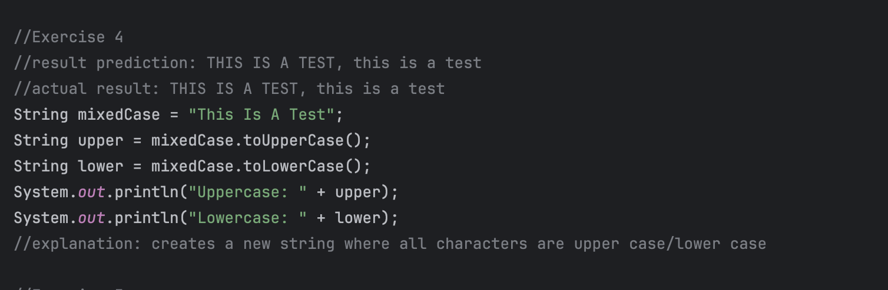
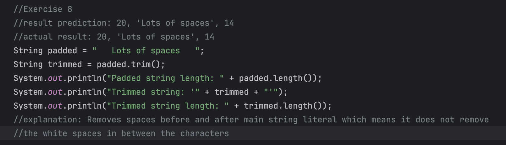

# Lab: Exploring Java String Methods

### by:Ivan Patrick Frondozo

## Description:

## Output:

### Exercise 1: length()

### Exercise 2: charAt()

### Exercise 3: substring()

### Exercise 4: toUpperCase() and toLowerCase()

### Exercise 5: indexOf()

### Exercise 6: equals() vs equalsIgnoreCase()

### Exercise 7: replace()

### Exercise 8: trim()

